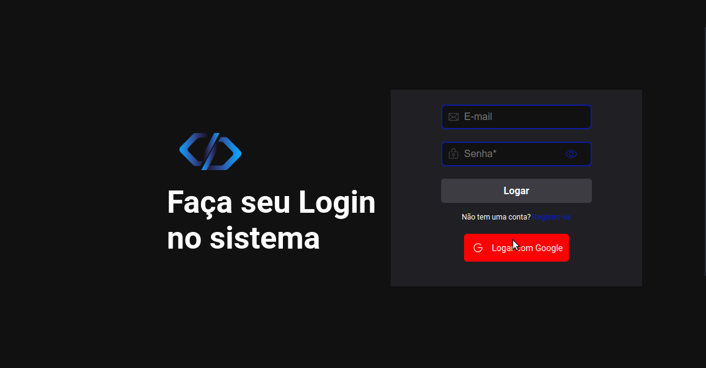

## Descrição do projeto
**Objetivo do Projeto**
- ``Sistema de Chamados com cadastro de clientes e usuários.``

## 🔨Funcionalidades
  - ``Funcionalidade 1 - Criar chamados``
  - ``Funcionalidade 2 - Autenticar usuário``
  - ``Funcionalidade 3 - Deletar usuário``
  - ``Funcionalidade 4 - Permissão de rotas se logado no firebase``
  - ``Funcionalidade 5 - Resposta visual com Toastify``
  - ``Funcionalidade 6 - ContextAPI repassando propriedades e controlando estado``
  - ``Funcionalidade 7 - Deploy no Heroku app``

  
## ✔️ Técnicas e Tecnologias utilizadas
**Instalar o firebase**
- ``npm i firebase@8.10.1``

**Editar configurações de acesso ao storage do firebase**

 - Altere as regras:

rules_version = '2';

service firebase.storage {

  match /b/{bucket}/o {

    match /{allPaths=**} {

      allow write: if request.auth != null;

      allow read;

    }

  }

}

**Rodar aplicação**
- ``npm run dev``

**Instalar o Axios**
- ``npm i axios``

**Instalar phosphor-react**
- ``npm install --save phosphor-react``

**Instalar o react-router-dom**
- ``npm i react-router-dom``

## 📁 Acesso ao projeto
Acesse os arquivos do projeto [aqui](https://github.com/haileicristina/sistemaChamados)

